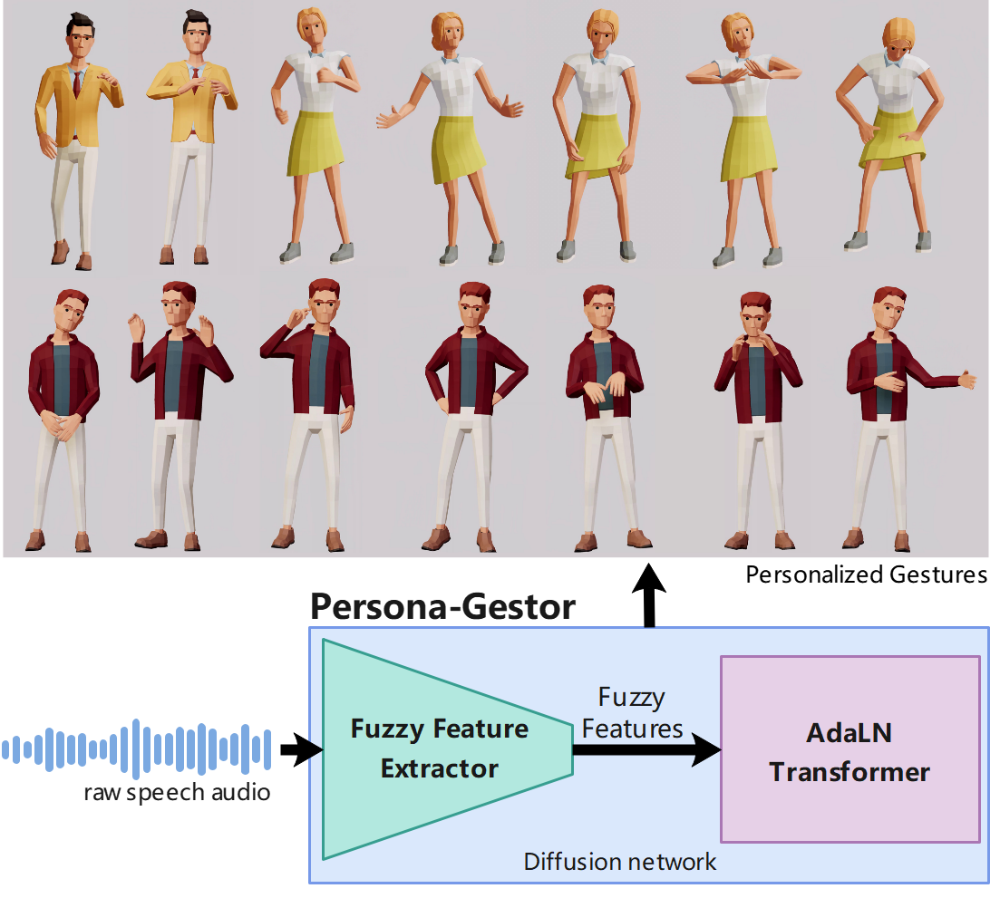

# Persona_Gestor (Source Code is coming soon!)
## Speech-driven Personalized Gesture Synthetics: Harnessing Automatic Fuzzy Feature Inference
# Abstract
Speech-driven gesture generation is an emerging field within virtual human creation. However, a significant challenge lies in accurately determining and processing the multitude of input features (such as acoustic, semantic, emotional, personality, and even subtle unknown features). Traditional approaches, reliant on various explicit feature inputs and complex multimodal processing, constrain the expressiveness of resulting gestures and limit their applicability.


To address these challenges, we present **Persona-Gestor**, a novel end-to-end generative model designed to generate highly personalized 3D full-body gestures solely relying on raw speech audio. The model combines a fuzzy feature extractor and a non-autoregressive Adaptive Layer Normalization (AdaLN) transformer diffusion architecture. The fuzzy feature extractor harnesses a fuzzy inference strategy that automatically infers implicit, continuous fuzzy features. These fuzzy features, represented as a unified latent feature, are fed into the AdaLN transformer. The AdaLN transformer introduces a conditional mechanism that applies a uniform function across all tokens, thereby effectively modeling the correlation between the fuzzy features and the gesture sequence. This module ensures a high level of gesture-speech synchronization while preserving naturalness. Finally, we employ the diffusion model to train and infer various gestures. Extensive subjective and objective evaluations on the Trinity, ZEGGS, and BEAT datasets confirm our model's superior performance to the current state-of-the-art approaches.


**Persona-Gestor** improves the system's usability and generalization capabilities, setting a new benchmark in speech-driven gesture synthesis and broadening the horizon for virtual human technology.


Each pose depicted is personalized gestures generated solely relying on raw speech audio. Persona-Gestor offers a versatile solution, bypassing complex multimodal processing and thereby enhancing user-friendliness.


For clarity, our contributions are summarized as follows:
1) **We pioneering introduce the fuzzy feature inference strategy that enables driving a wider range of personalized gesture synthesis from speech audio alone, removing the need for style labels or extra inputs.**
This fuzzy feature extractor improves the usability and the generalization capabilities of the system. To the best of our knowledge, it is the first approach that uses fuzzy features to generate co-speech personalized gestures.
2) **We combined AdaLN transformer architecture within the diffusion model to enhance the Modeling of the gesture-speech interplay.** We demonstrate that this architecture can generate gestures that achieve an optimal balance of natural and speech synchronization.
3) **Extensive subjective and objective evaluations reveal our model superior outperform to the current state-of-the-art approaches.** These results show the remarkable capability of our method in generating credible, speech-appropriateness, and personalized gestures.

Presentation page: https://zf223669.github.io/Diffmotion-v2-website/

Showcases(Goodele Drive): https://drive.google.com/drive/folders/1YWQaS4BZZsYvPAKychusLJOhT--dfv2G

Showcases(Baidu Cloud Disk): https://pan.baidu.com/s/1Mt6K-mVUnAcLk6Ol8NALQA?pwd=1234

# Environment
- Ubuntu 18.04
- Python 3.11
- CUDA 12
- PyTorch 2.2.2
- Pytorch-lightning 2.2.3 <br>
Note: 
- 1.We recommend using Anaconda to manage your Python environment. 
- 2.We recommend using GPU (such as A100, V100) that more memory is available for faster training.  For inferecing, we recommend using RTX 3090 or higher.
# Installations
We provide a requirements.txt for installation.
code:
```
git clone https://github.com/zf223669/Persona_Gestor.git
cd Persona_Gestor    # enter the project directory
conda create -n PG python==3.11
conda activate PG
pip install -r requirements.txt
```

Download the WavLM pre-train model from:

  WavLM-Base+: https://drive.google.com/file/d/1-zlAj2SyVJVsbhifwpTlAfrgc9qu-HDb/view <br>
  WavLM-Large: https://drive.google.com/file/d/12-cB34qCTvByWT-QtOcZaqwwO21FLSqU/view <br>
  When downloaded, place the pre-train model (WavLM-Base+.pt and WavLM-Large.pt) in the "src/utils/wavlm/pretrain-models/" folder. <br>
  
  Note: You also could head to the WavLM original Source code repository for more details: https://github.com/microsoft/unilm/tree/master/wavlm <br>
  More WavLM models could be found in the following link: https://huggingface.co/models?other=wavlm&sort=trending&search=WavLM-Base <br>


# Datasets download and preprocessing
## 1. Downloaded datasets
We use three datasets for training and evaluation: Trinity, ZEGGS, and BEAT. You can download and preprocess each dataset separately.
- Trinity: https://trinityspeechgesture.scss.tcd.ie/
- ZEGGS: https://github.com/ubisoft/ubisoft-laforge-ZeroEGGS
- BEAT: https://drive.google.com/file/d/1Akf0WgAwuH2fvlWbvNpif4XRqXlpznh9/view

When downloaded, extract the files and place them in the data folder. Then make the folders and copy the audio files in to the audio folder, and the bvh files in to the bvh folder.
like this:

```
data
├── BEAT
│   └── Sources
│      ├── audio
│      └── bvh
├── BEAT_processed_20s (When pre-processing is finished, the processed data is stored here)
│   └─ feat_20fps_20s_WithExp_waveform_WithStd (Do not modify the folder name)
├── Trinity 
│   └── Sources
│      ├── audio
│      └── bvh
├── Trinity_processed_20s (When pre-processing is finished, the processed data is stored here)
│   └── feat_20fps_20s_WithExp_waveform_WithStd (Do not modify the folder name)
├── ZEGGS
│   └── Sources
│      ├── audio
│      └── bvh
├── ZEGGS_processed_20s (When pre-processing is finished, the processed data is stored here)
│   └── feat_20fps_20s_WithExp_waveform_WithStd (Do not modify the folder name)
```

### Note: Due to some issues with the ZEGGS and BEAT datasets, we have provided processed data for your convenience. You can download the processed data from the following links:
The Fixed and Processed Dataset could be downloaded from: <br>
Trinity: https://pan.baidu.com/s/1EFxbOsxs4bylBfl9AyvhwA?pwd=1234 Extraction code: 1234<br>
ZEGGS：https://pan.baidu.com/s/1IVTY6K6JaG_yK-6-hvvOOg?pwd=1234  Extraction code: 1234 <br>
BEAT:  https://pan.baidu.com/s/1a9a74MMkhYDWZqDzSoNiBA?pwd=1234  Extraction code: 1234 <br>
and place the extracted files in the corresponding folders.

## 2. Preprocessing
We use the pre-processing method proposed by https://github.com/simonalexanderson/StyleGestures, but change the audio feature extractor to raw audio information. (Each dataset is trained separately and you can train it individually according to your needs.)

## 2.1 Preprocessing Trinity
First, find the preprocessing configs in the /configs_diffmotion/data/Trinity/prepare_trinity_dataset.yaml. <br>
Make sure and set the parameters (data_dir and processed_dir) at the top 2 lines, as follows: <br>
  data_dir: the path to the data folder <br>
  processed_dir: the path to the processed data folder. like this: <br>
```
#Run in terminal:
    data_dir: ./data/Trinity/Sources 
    processed_dir: ./data/Trinity/processed_20s 
#or in IDE:
  data_dir: ../../../../data/Trinity/Sources 
  processed_dir: ../../../../data/Trinity/processed_20s 
```
Second, run the preprocessing Trinity dataset:<br>
```
cd src/data/Data_Processing/Trinity_full_Spine/
python prepare_trinity_datasets.py
# The whole preprocessing time is about 20 minutes, you can use the pre-processed data provided by us.
```
## 2.2 Preprocessing ZEGGS
First, find the preprocessing configs in the /configs_diffmotion/data/EGGS/prepare_EGGS_dataset.yaml.<br>
Make sure and set the parameters (data_dir and processed_dir) at the top 2 lines, as follows: <br>
  data_dir: the path to the data folder <br>
  processed_dir: the path to the processed data folder. like this: <br>
```
#Run in terminal:
    data_dir: ./data/ZEGGS/Sources 
    processed_dir: ./data/ZEGGS/processed_20s 
#or in IDE:
  data_dir: ../../../../data/ZEGGS/Sources 
  processed_dir: ../../../../data/ZEGGS/processed_20s 
```
Second, run the preprocessing ZEGGS dataset:<br>
```
cd src/data/Data_Processing/ZEGGS/
python prepare_EGGS_datasets.py
# The whole preprocessing time is about 2 hour, you can use the pre-processed data provided by us.
```

## 2.3 Preprocessing BEAT
First, find the preprocessing configs in the /configs_diffmotion/data/BEAT/prepare_BEAT_dataset.yaml.<br>
Make sure and set the parameters(data_dir and processed_dir) at the top 2 lines, as follows: <br>
  data_dir: the path to the data folder <br>
  processed_dir: the path to the processed data folder. like this: <br>
```
#Run in terminal:
    data_dir: ./data/BEAT/Sources 
    processed_dir: ./data/BEAT/processed_20s 
#or in IDE:
  data_dir: ../../../../data/BEAT/Sources 
  processed_dir: ../../../../data/BEAT/processed_20s
```
Second, run the preprocessing BEAT dataset:<br>
```
cd src/data/Data_Processing/BEAT/
python prepare_BEAT_datasets.py
# The whole preprocessing time is about 12 hours, you can use the pre-processed data provided by us.
```

# 3. Inference
## 3.1 Download the pre-trained model
We provide the trained model for inference. You can download the model from the following link: <br>
- Trinity: https://pan.baidu.com/s/1O-1qa9PciDDaEWVUxIMXcQ?pwd=1234 extraction code: 1234
- ZEGGS:   https://pan.baidu.com/s/1hNrifBzlal91EjkVrExh3g?pwd=1234 extraction code: 1234
- BEAT:    https://pan.baidu.com/s/1qTxHEpwXRsZlyOm9u1UdSw?pwd=1234 extraction code: 1234

Then, place the downloaded model in the "src/models/Trinity/" folder, "src/models/ZEGGS/" folder, and "src/models/BEAT/" folder, respectively.
## 3.2 Set the config file
We provide the config files for each dataset. You can set the parameters according to your needs. All the config files are in the /configs_diffmotion/experiment <br>
xxx_WavLM_based.yaml files are for WavLM_Base+ model  and xxx_WavLM_large.yaml files are for WavLM_Large model.<br>
- Trinity: Trinity_Inference_WavLM_based.yaml  or  Trinity_Inference_WavLM_large.yaml 
- ZEGGS: ZEGGS_Inference_WavLM_based.yaml  or  ZEGGS_Inference_WavLM_large.yaml 
- BEAT:  BEAT_Inference_WavLM_large.yaml
 
Open the parameter file and set the parameters according to your needs, as follows: <br>
```
ckpt_path: the path to the downloaded pre-trained model
paths:
  data_dir: ./data/xxx/processed_20s  # replace xxx with the dataset name
data:
  dataset: ${paths.data_dir}/feat_20fps_20s_WithExp_waveform_WithStd

```
## 3.3 Run the inference
We provide the inference code for each dataset. You can run the inference code according to your needs.
```
# enter the root directory of the project
python src/diffmotion/diffmotion_trainer/train_diffmotion.py -m experiment=Trinity_Inference_WavLM_[based/large].yaml
```
The inference results will be saved in the "logs/log_xxx/xxx/multi\DATA_Time" folder. (DATA_Time is the date and time when the inference is started.)


# 4. Training
We provide the training code for each dataset. You can train the model according to your needs.
```
# Set the dataset path and processed data path in the config file, like in 3.
# Enter the root directory of the project
# Then run
python src/diffmotion/diffmotion_trainer/train_diffmotion.py -m experiment=xxx_Training_WavLM_[based/large].yaml
```

# 5. Inference by using in-the-wild speech audio
We provide in-the-wild speech audios from TED Video or you can prepare by yourself (need mono channel). <br>
Note:We recommand you to use the BEAT pre-trained model for inference. <br>
All the audio files are in the "data/TED/audio" folder. <br>
Set the data_dir and processed_dir in the config file to specify the audio directory, like in Step 2. <br>
Copy the input_scaler.sav file from BEAT processed data folder to the "src/models/BEAT/" folder. <br>
run:
```
python src/data/BEAT_Only_Audio/prepare_BEAT_datasets.py
```
Copy the output_scaler.sav and data_pipe_20fps.save files from BEAT processed data folder to the processed data folder. <br>

run:
```
python src/diffmotion/diffmotion_trainer/train_diffmotion.py -m experiment=In_the_wild_Inference_WavLM_[based/large].yaml
```


